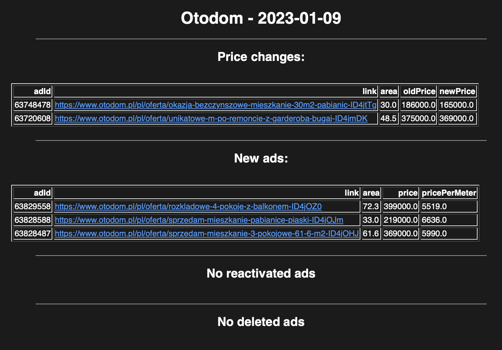

# Otodom Web Scraper
[Otodom] is a website containing ads for the sale and rental of properties. This is a Python web scraper to fetch data with flats for sale in selected city and send email with alerts for changes in ads' listing.

## How it works
### scrap_data.py
- Script is getting response of selected page (pageResposne function) 
- JSON with ads is processed to obtain the required ad data (fetchData function) and save it to csv file

### generate_alerts.py
This script is generating alerts based on fetched ads data from current day.
- Changes of price (priceChange function)
- Newly added ads (newAds function)
- Ads that have been reactivated (reactivatedAds function)
- Ads that have been deleted (deletedAds function)

Output of each function is saved to csv file
    
### generate_mail.py
Based on the generated alerts, we will create an HTML email template that will contain the
information about changes in the ads. The script checks each alert file to get alerts for the 
current date. The script then generates the text for each part and merges it into one. Generated output is saved to a csv file.

### send_mail.py
This script takes reault of generate_mail.py file and send e-mail message from gmail account.

### functions.py
Function to save dataframe to csv file with prior deletion of the current day's data. This allows you to run the program safely and avoid duplicating data

### runner.py 
Script that runs the different parts of the program in the correct order

## Test directory
The test directory contains a file that generates dataframes (generate_df.py), which are used to test the functions responsible for generating alerts (test_generate_alerts.py)

## Example of generated email

[//]: #
[otodom]: https://www.otodom.pl/